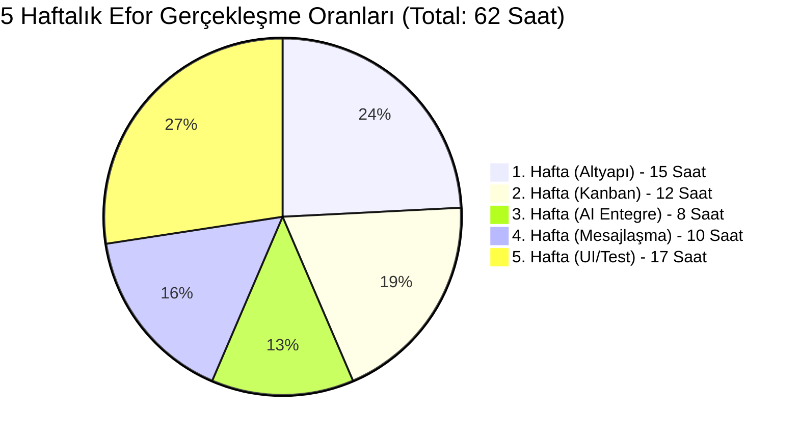

<p align="center">
  
  
  
  
  
</p>

<h1 align="center">🌿 GoldBranch AI</h1>
<h3 align="center">Yapay Zeka Destekli Akıllı Proje & Görev Yönetim Sistemi</h3>

<p align="center">
  <i>Ekip yönetimi, görev takibi, yapay zeka iş analizi ve gerçek zamanlı iletişimi tek bir platformda birleştiren kurumsal düzeyde bir web uygulaması.</i>
  <br>👉 <a href="docs/images/login.jpg"><strong>Oturum Açma Ekran Görselini İncele</strong></a>
</p>

---

## 📋 İçindekiler

- [Proje Hakkında](#-proje-hakkında)
- [Öne Çıkan Bonus Özellikler](#-öne-çıkan-bonus-özellikler)
- [Mimari & Teknolojiler](#-mimari--teknolojiler)
- [Geliştirme Performansı (Planlanan vs Gerçekleşen)](#-geliştirme-performansı)
- [Ekran Görüntüsü Galerisi](#-ekran-görüntüsü-galerisi)
- [Kurulum & Çalıştırma](#-kurulum--çalıştırma)
- [Proje Yapısı](#-proje-yapısı)

---

## 🎯 Proje Hakkında

**GoldBranch AI**, yazılım geliştirme ekiplerinin proje yönetim süreçlerini dijitalleştirmek ve yapay zeka ile desteklemek amacıyla geliştirilmiş kapsamlı bir ASP.NET Core MVC web uygulamasıdır. Proje planında yer alan temel gereksinimler aşılarak sisteme devrimsel extra özellikler katılmıştır.

### Projenin Çözdüğü Problemler

| Problem | GoldBranch AI Çözümü |
|---------|---------------------|
| Görev dağılımı ve takibi zor | Kanban panosu + Akıllı sıralama (Aura Logic) |
| Ekip içi iletişim dağınık | WhatsApp tarzı entegre mesajlaşma sistemi |
| İş yükü analizi yapılamıyor | Isı haritası + Tükenmişlik analizi |
| Toplantılarda zaman kaybı | AI ile otomatik görev alt kırılımı |
| Performans ölçülemiyor | Liderlik tablosu + Z-Raporu |
| Mesai takibi yok | Otomatik ekran süresi sayacı |

---

## ✨ Öne Çıkan BONUS Özellikler (Proje Planı Dışı Eklemeler)

Temel gereksinimlerin dışında, uygulamayı endüstri standardına taşımak için **proje planında yer almayan** birçok bonus özellik eklenmiştir:

1. **🧠 Google Gemini 2.0 Flash Entegrasyonu:**
   Sadece veritabanı CRUD operasyonlarıyla yetinilmedi. Sistem içine yapay zeka entegre edildi:
   - *AI Görev Kırılımı*: Verilen bir işi alt görevlere bölen, efor ve öncelik atayan otomatik beyin motoru.
   - *AI Araştırma Asistanı*: Geliştiricilerin sistem içinden çıkmadan teknik destek alabildiği chat asistanı.

2. **💬 Canlı WhatsApp Tarzı Mesajlaşma (Bonus):**
   Sadece e-posta odaklı basit bildirimler yerine tam teşekküllü, gruplar ve Direkt Mesajlar içeren bir iletişim platformu.

3. **👁️ Admin "İzleme Modu" (Bonus):**
   Yöneticilerin geliştirici ve proje şefi arasındaki özel konuşmaları izleyebilmesini sağlayan istihbarat özelliği.

4. **✨ Aura Logic & Premium UI/UX:**
   Sıradan HTML formları yerine, 5 farklı özelleştirilmiş tema (Glassmorphism + Neon animasyonları). Kanban panosunda işleri son teslim tarihine göre otomatik filtreleyen renk kodlaması.

5. **⏱ Gerçek Zamanlı Mesai Takibi:**
   Local storage ve AJAX ping yöntemleri kullanılarak arka planda session süresini hesaplayan otomatik mesai ölçer. Liderlik panosuna veri sağlar.

---

## 🏗 Mimari & Teknolojiler

```text
┌──────────────────────────────────────────────────┐
│                   SUNUM KATMANI                   │
│  Razor Views (.cshtml) + Bootstrap 5.3 + CSS3    │
│  Glassmorphism / Particle Effects / Animations    │
├──────────────────────────────────────────────────┤
│                  İŞ MANTIK KATMANI                │
│  ASP.NET Core 8.0 MVC Controllers               │
│  TaskController, ChatController, AdminController  │
│  AiController, AuthController, TimeTracker       │
├──────────────────────────────────────────────────┤
│                 SERVİS KATMANI                    │
│  GeminiService (Google Gemini AI API)            │
│  Cookie Authentication + Google OAuth 2.0        │
├──────────────────────────────────────────────────┤
│               VERİ ERİŞİM KATMANI                │
│  Entity Framework Core 8.0 (Code-First)          │
│  SQL Server LocalDB                              │
│  AppDbContext + Fluent API Konfigürasyonu         │
└──────────────────────────────────────────────────┘
```

---

## 📊 Geliştirme Performansı (Planlanan vs Gerçekleşen Efor)

Proje başlangıcında **100 Adam-Saat** olarak planlanan bu büyük mimari; doğru kurgu, AI destekli kodlama ve verimli EF Core yönetimi sayesinde **toplam 62 Adam-Saat**'te başarıyla tamamlanmıştır. Her fazda beklenenden çok daha yüksek performans gösterildi.


*\*3. Hafta: AI Modül entegrasyonu, Gemini Chatbot sayesinde rekor sürede (8s) entegre edilerek büyük zaman tasarrufu sağlanmıştır.*

---

## 📸 Ekran Görüntüsü Galerisi

Görselleri tam çözünürlükte incelemek için lütfen ilgili bağlantılara tıklayın:

1. 👉 [**Geliştirici Çalışma Masası (Dashboard)**](docs/images/dashboard.jpg) - Tema sistemi ile kontrol edilebilir modern çalışma alanı.
2. 👉 [**Gemini AI Görev Analiz Motoru**](docs/images/ai_breakdown.jpg) - Yapay zeka efor ve strateji çıkarıcı.
3. 👉 [**Admin Sistem İzleme & Radar Modu**](docs/images/system_radar.jpg) - Sistem içi log mesajları terminali.
4. 👉 [**Gelişmiş 5 Farklı Tema Merkezi**](docs/images/themes.jpg) - Kullanıcının ruh haline ve UX deneyimine göre ayarlanabilir arayüzler.

---

## 🚀 Kurulum & Çalıştırma

```bash
# 1. Repoyu klonlayın
git clone https://github.com/enesaltndll/GoldBranchAI.git
cd GoldBranchAI

# 2. Bağımlılıkları yükleyin
dotnet restore

# 3. Veritabanını oluşturun & Uygulamayı çalıştırın
dotnet run
```

### Varsayılan Giriş Bilgileri

| Rol | E-posta | Şifre |
|-----|---------|-------|
| 👑 Admin | admin@test.com | admin123 |
| ⭐ Proje Şefi | sef@test.com | sef123 |
| 💻 Geliştirici | dev@test.com | dev123 |

> ⚠️ Google Gemini API anahtarı ayarları için `appsettings.json` dosyanıza kendi değerinizi girmeyi unutmayın.

---

## 👨‍💻 Geliştirici & Danışman

**Öğrenci:** Enes Altındal (247017024)   
**Sorumlu Öğretim Üyesi:** Öğr. Gör. Ekrem Saydam   
**Kurum:** Sinop Üniversitesi / Ayancık Meslek Yüksekokulu

<p align="center">
  <b>⭐ Projeyi beğendiyseniz github'da yıldız vermeyi unutmayın! ⭐</b>
</p>
