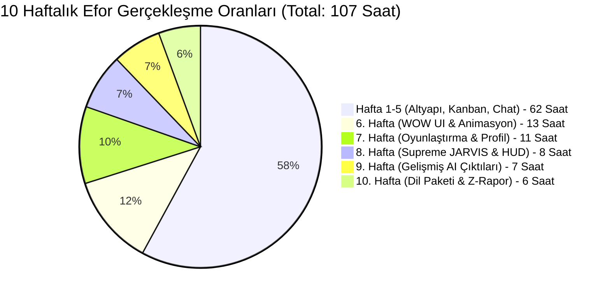

<p align="center">
  
  
  
  
  
</p>

<h1 align="center">🌿 GoldBranch AI (Vize Sonrası Final Sürümü)</h1>
<h3 align="center">Yapay Zeka Destekli Akıllı Proje & Görev Yönetim Sistemi</h3>

<p align="center">
  <i>Ekip yönetimi, görev takibi, yapay zeka iş analizi ve gerçek zamanlı iletişimi tek bir platformda birleştiren kurumsal düzeyde bir web uygulaması.</i>
</p>

---

## 📋 İçindekiler

- [Proje Hakkında](#-proje-hakkında)
- [Öne Çıkan Bonus Özellikler](#-öne-çıkan-bonus-özellikler)
- [Mimari & Teknolojiler](#-mimari--teknolojiler)
- [Geliştirme Performansı (10 Haftalık Analiz)](#-geliştirme-performansı-10-haftalık-analiz)
- [Kurulum & Çalıştırma](#-kurulum--çalıştırma)

---

## 🎯 Proje Hakkında

**GoldBranch AI**, yazılım geliştirme ekiplerinin proje yönetim süreçlerini dijitalleştirmek ve yapay zeka ile desteklemek amacıyla geliştirilmiş kapsamlı bir ASP.NET Core MVC web uygulamasıdır. Proje planında yer alan temel gereksinimler aşılarak sisteme devrimsel extra özellikler katılmıştır.

### Projenin Çözdüğü Problemler

| Problem | GoldBranch AI Çözümü |
|---------|---------------------|
| Görev dağılımı ve takibi zor | Kanban panosu + Akıllı sıralama (Aura Logic) |
| Ekip içi iletişim dağınık | WhatsApp tarzı entegre mesajlaşma sistemi |
| İş yükü analizi yapılamıyor | Filtrelenebilir Z-Raporu + Tükenmişlik haritası |
| Performans ölçülemiyor | Oyunlaştırma (Gamification) tabanlı XP ve Rozet sistemi |
| Meslek hastalıkları & Masa başı ağrıları | Wellness Guardian (Sağlık Kalkanı) ile otomatik yönlendirmeli molalar |

---

## ✨ Öne Çıkan BONUS Özellikler (Vize Sonrası Eklemeler)

İlk 5 haftadaki altyapının üzerine, **6. ve 10. haftalar arası** şu endüstri standardı ve "WOW" dedirten özellikler sisteme kazandırılmıştır:

1. **🎭 Oyunlaştırma (Gamification) & Profil:**
   Geliştirici motivasyonunu artırmak için sistemi bir oyun gibi kurguladık. Görev bitirildikçe XP (Tecrübe Puanı) kazanılıyor, seviye atlanıyor ve başarımlara (İlk Kan, Şampiyon) göre rozet kilitleri açılıyor.

2. **🎙️ Supreme JARVIS Voice Interface & HUD:**
   Sistemi tamamen sesli komutlarla yönetebileceğiniz, fütüristik bir HUD katmanı ve gerçek zamanlı yapay zeka geri bildirimi içeren kontrol merkezi.

3. **🌍 Uluslararası Dil Desteği (Localization):**
   Sistemi tamamen İngilizce ve Türkçe olarak çift dilli kullanıma uygun hale getirdik. Tüm UI dinamik `L.Get()` yapısına geçirildi.

4. **✨ WOW Tasarım & Temalar:**
   Sıkıcı paneller yerine; Glassmorphism (şeffaf cam efekti), dinamik tema motoru ve 1400px merkezli modern layout ile UI/UX zirveye taşındı.

5. **📄 AI Akademik Çıktı Exportları:**
   ChatGPT benzeri asistanımız sadece konuşmakla kalmıyor, proje analiz detaylarını doğrudan `.doc` formatında indirebilecek bir mimari sunuyor.

---

## 🏗 Mimari & Teknolojiler

```text
┌──────────────────────────────────────────────────┐
│                   SUNUM KATMANI                   │
│  Razor Views (.cshtml) + Vanilla JS + CSS3       │
│  L.Get() Localization / Glassmorphism / Bootstrap│
├──────────────────────────────────────────────────┤
│                  İŞ MANTIK KATMANI                │
│  ASP.NET Core 8.0 MVC / SignalR                 │
│  Wellness Engine, Gamification Engine             │
├──────────────────────────────────────────────────┤
│                 SERVİS KATMANI                    │
│  GeminiService (Google Gemini API)               │
│  Cookie Auth + File Export Service               │
├──────────────────────────────────────────────────┤
│               VERİ ERİŞİM KATMANI                │
│  Entity Framework Core 8.0 (Code-First)          │
│  SQL Server LocalDB                              │
└──────────────────────────────────────────────────┘
```

---

## 📊 Geliştirme Performansı (10 Haftalık Analiz)

Projemiz, Vize Öncesi (Hafta 1-5) ve Vize Sonrası Final (Hafta 6-10) olmak üzere iki büyük iterasyonda titizlikle yürütülmüştür. Toplamda **107 Adam-Saat** efor sarf edilmiştir.



### 🌟 Masterclass Güncellemeleri (v2.5)
*   **🛡️ Ghost Mode:** Halka açık alanlarda çalışırken hassas verileri (görev başlıkları, kullanıcı isimleri) tek tuşla buzlayan (blur) gizlilik katmanı.
*   **🎙️ AI Daily Briefing:** Güne başlarken o günkü önceliklerini, nöral yükünü ve stratejik tavsiyelerini sesli olarak dinleyebileceğin yapay zeka asistanı.
*   **🕰️ Project Time Machine:** Kanban tahtasında geçmişteki 30 güne kadar yolculuk yapmanı sağlayan interaktif zaman çizelgesi.
*   **📜 Achievement Certificate:** Başarılarını ve XP puanlarını resmi bir sertifika olarak belgeleyen ve sosyal medyada paylaşmanı sağlayan sistem.
*   **🧘 Zen Mode 2.0:** Genişletilebilir video paneli ve yeni odaklanma sesleri ile derin çalışma ortamı.
*   **🎙️ Jarvis 2.0 HUD:** `Ctrl+K` ile açılan, holografik ses dalgaları ve nöral arayüz ile donatılmış yeni sesli komut ekranı.

---
Bu proje, bir görev yöneticisinden daha fazlasıdır; o senin **Yapay Zeka Karargahındır.** 🚀🦾🔥

*\*6-10 Haftaları: Sistemin standart bir görev panosundan çıkarak yapay zeka, kullanıcı deneyimi ve vizyoner bir sağlık sistemine evrilme sürecidir.*

---

## 🚀 Kurulum & Çalıştırma

```bash
# 1. Repoyu klonlayın
git clone https://github.com/enesaltndll/Vize-Sonrasi-Goldbranch-AI.git
cd Vize-Sonrasi-Goldbranch-AI

# 2. Bağımlılıkları yükleyin
dotnet restore

# 3. Veritabanını oluşturun & Uygulamayı çalıştırın
dotnet run
```

### Varsayılan Giriş Bilgileri

| Rol | E-posta | Şifre |
|-----|---------|-------|
| 👑 Admin | admin@test.com | admin |
| ⭐ Proje Şefi | sef@test.com | sef12 |
| 💻 Geliştirici | dev@test.com | dev1 |

> ⚠️ Google OAuth ve AI anahtarları güvenlik nedeniyle GitHub'dan çıkartılmıştır.

---

## 👨‍💻 Geliştirici

**Enes Altındal** (247017024)   
**Sorumlu Öğretim Üyesi:** Öğr. Gör. Ekrem Saydam   
**Kurum:** Sinop Üniversitesi / Ayancık Meslek Yüksekokulu
