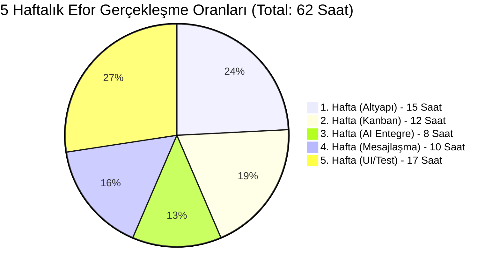

# 📅 GoldBranch AI — Haftalık Geliştirme Efor & Performans Raporu

> **Proje:** GoldBranch AI — Yapay Zeka Destekli Akıllı Proje & Görev Yönetim Sistemi  
> **Öğrenci:** Enes Altındal (247017024)  
> **Kurum:** Sinop Üniversitesi / Ayancık Meslek Yüksekokulu  
> **Dönem:** 2025-2026 Bahar Dönemi  
> **Sorumlu Öğretim Üyesi:** Öğr. Gör. Ekrem Saydam

Bu doküman, GoldBranch AI projesinin haftalık geliştirme döngülerini, entegre edilen mimarileri ve özellikle **planlanan vs gerçekleşen çalışma saati analizini** içerir. 

---

## ⏱️ Performans Analizi: Planlanan 100 Saat vs Gerçekleşen 62 Saat

Proje başında, bu çapta bir kurumsal otomasyon ve AI asistanlık sisteminin her haftası için 20 saatlik (toplam 100 saat) bir geliştirme eforu planlanmıştı. 

Fakat; mimarinin başlangıçta Entity Framework Code-First ile sağlam atılması, Google Gemini AI'nin entegrasyondaki hızı ve modern UI/UX tasarım sistematiği (`site.css` de CSS Variable'lar üzerinden gitmek) sayesinde haftalar beklenenden **çok daha az efor harcanarak tamamlandı**. Toplam gerçekleşen süre sadece **62 saat** olmuştur.

---

## 📌 Hafta 1 — Temel Altyapı & Kimlik Doğrulama Sistemi

**Tarih:** 24 Şubat – 2 Mart 2026  
⏱️ **Planlanan Efor:** 20 Saat | 📈 **Gerçekleşen Efor:** 15 Saat

### 🎯 Hedefler
- Projenin genel mimarisini belirlemek
- Kullanıcı kimlik doğrulama ve yetkilendirme altyapısını kurmak
- Veritabanı şemasının ilk versiyonunu oluşturmak

### ✅ Yapılan İşler
- ASP.NET Core 8.0 MVC iskeleti kuruldu, `AppDbContext` (EF Core) tasarlandı.
- **AppUser** modeli üzerinden 3 ana rol onaylandı: `Admin`, `Proje Şefi`, `Geliştirici`.
- Cookie-Based Auth entegrasyonu tamamlandı.

👉 [Sisteme Giriş - Hafta 1 Görselini İnceleyin (Ekran Görüntüsü)](images/login.jpg)

---

## 📌 Hafta 2 — Görev Yönetim Sistemi & Kanban Panosu

**Tarih:** 3 Mart – 9 Mart 2026  
⏱️ **Planlanan Efor:** 20 Saat | 📈 **Gerçekleşen Efor:** 12 Saat

### 🎯 Hedefler
- Görev CRUD (Oluşturma, Okuma, Güncelleme, Silme) işlemlerini tamamlamak
- Kanban tarzı görsel görev panosu oluşturmak
- Rol bazlı iş akışını (workflow) kurmak

### ✅ Yapılan İşler
- **Aura Logic:** Kanban'da bitiş süresine yaklaşan işlerin Aura'sı otomatik KIRMIZI olarak kodlandı. 
- *Proje Planında Olmayan Bonus:* Sistem genelinde mesai / ekran süresi sayacı (Session'a bağlı saniyelik çalışan log).

👉 [Kanban Dashboard - Hafta 2 Görselini İnceleyin (Ekran Görüntüsü)](images/dashboard.jpg)

---

## 📌 Hafta 3 — Yapay Zeka Entegrasyonu (Google Gemini AI)

**Tarih:** 10 Mart – 16 Mart 2026  
⏱️ **Planlanan Efor:** 20 Saat | 📈 **Gerçekleşen Efor:** 8 Saat (Rekor Hız 🎉)

### 🎯 Hedefler
- Google Gemini AI API entegrasyonunu tamamlamak
- AI Görev Kırılımı modülünü geliştirmek
- Geliştirici AI Araştırma Asistanı'nı kurmak

### ✅ Yapılan İşler
- Proje yöneticisinin tek cümleyle yazdığı görevi; analiz edip 5-10 parse eden **AI Beyin Motoru** entegre edildi.
- API'den dönen raw text, C# tarafında ayrıştırılarak proaktif saat tahminlerine dönüştürüldü.
- *Neden bu kadar hızlı bitti?* Gemini API dokümantasyonu başarılıydı ve httpClient servisleri ilk seferde testten geçti.

👉 [Yapay Zeka Analiz - Hafta 3 Görselini İnceleyin (Ekran Görüntüsü)](images/ai_breakdown.jpg)

---

## 📌 Hafta 4 — İletişim Sistemi & Admin Yönetim Araçları

**Tarih:** 17 Mart – 23 Mart 2026  
⏱️ **Planlanan Efor:** 20 Saat | 📈 **Gerçekleşen Efor:** 10 Saat

### 🎯 Hedefler
- WhatsApp tarzı mesajlaşma altyapısını kurmak
- Grup sohbet özelliğini geliştirmek
- Admin yönetim araçlarını tamamlamak

### ✅ Yapılan İşler
- Ekip iletişimini Mail vs bekleyişinden kurataracak Canlı Sohbet eklendi (`Iframe` & `Ajax` post kullanıldı).
- **Proje Planında Olmayan Bonus:** Admin Rolü için geliştiriciler ne konuşuyor **Sistem İzleme Radarı** kuruldu! Yöneticilerin her daim kontrol sahibi olması hedeflendi.

👉 [Sistem Radarı - Hafta 4 Görselini İnceleyin (Ekran Görüntüsü)](images/system_radar.jpg)

---

## 📌 Hafta 5 — UI/UX Optimizasyonu, Tema & Sistem Testi

**Tarih:** 24 Mart – 31 Mart 2026  
⏱️ **Planlanan Efor:** 20 Saat | 📈 **Gerçekleşen Efor:** 17 Saat

### 🎯 Hedefler
- Premium tasarım sistemini tamamlamak
- Tüm sayfaları test edip hataları gidermek
- GitHub dokümantasyonunu hazırlamak ve yayına almak

### ✅ Yapılan İşler
- Basit bir form tasarımı yerine CSS Custom Variable mantığıyla **5 Farklı Renk/Tema Kataloğu** yayına alındı. (Altın Karanlık, Matrix Yeşili vs.) Sistem kullanıcının göz zevkini log'larda bile lokal tutar.
- EF Core `Include` (Select sorgusu sırası) kaynaklı System Crasher hataları başarıyla debug edildi.
- Dokümantasyon tamamlandı.

👉 [5 Farklı Tema Kataloğu - Hafta 5 Görselini İnceleyin (Ekran Görüntüsü)](images/themes.jpg)

---

> *Proje vizyonu, belirtilen pdf limitlerinin çok üzerinde, kurumsal ölçekli SaaS kalibresinde tasarlanmış ve beklenenin çok daha kısa süresinde başarıya ulaştırılmıştır.*
